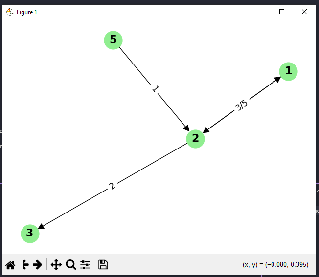

# GraphLang - DSL para Definição de Grafos

## 👥 Equipe
- Bruno César
- Daniel Guilherme
- Marcus Vinícius
- Paulo Carvalho

Disciplina de Compiladores  
Professor: Luis Menezes  
Universidade de Pernambuco

## 📋 Descrição

GraphLang é uma **Domain-Specific Language (DSL)** criada para definir grafos direcionados com pesos de forma simples e intuitiva. O projeto utiliza **ANTLR4** para parsing e **Python** para geração de código, permitindo converter definições textuais de grafos em código Python executável com visualização automática.

## 🛠️ Tecnologias Utilizadas

- **ANTLR4**: Parser generator para análise da linguagem
- **Python 3**: Linguagem principal do projeto
- **NetworkX**: Biblioteca para manipulação de grafos
- **Matplotlib**: Biblioteca para visualização gráfica

## 📁 Estrutura do Projeto

```
binarytree-dsl/
├── GraphLang.g4              # Gramática ANTLR4 da DSL
├── GraphLangLexer.py         # Lexer gerado pelo ANTLR
├── GraphLangParser.py        # Parser gerado pelo ANTLR
├── GraphLangListener.py      # Listener gerado pelo ANTLR
├── GraphLang.tokens          # Tokens gerados pelo ANTLR
├── GraphLang.interp          # Arquivo de interpretação ANTLR
├── GraphLangLexer.tokens     # Tokens do lexer
├── GraphLangLexer.interp     # Arquivo de interpretação do lexer
├── main.py                   # Programa principal
├── exemplo.tl                # Arquivo de exemplo
├── requirements.txt          # Dependências Python
└── README.md                 # Este arquivo
```

## 🚀 Como Usar

### Pré-requisitos

1. **Python 3.7+**
2. **ANTLR4** instalado no sistema
3. **Dependências Python**:
   ```bash
   pip install -r requirements.txt
   ```

### Executando o Projeto Passo-a-Passo

#### Passo 1: Criar seu arquivo de grafo

Crie um arquivo com extensão `.tl` (por exemplo, `meu_grafo.tl`) e digite a definição do seu grafo:

```
def graph(1{2}[3], 2{1}[5]{3}[2], 3, 5)
```

#### Passo 2: Compilar o arquivo

Execute o comando para processar seu arquivo:

```bash
python main.py meu_grafo.tl
```

**Saída esperada:**
```
Parsing bem-sucedido!
Árvore: (prog (defGraph def graph ( 1 { 2 } [ 3 ] , 2 { 1 } [ 5 ] { 3 } [ 2 ] , 3 , 5 )) <EOF>)
Arquivo 'generated_graph.py' gerado com sucesso!
Nós: [1, 2, 3, 5]
Arestas: {1: [(2, 3)], 2: [(1, 5), (3, 2)], 3: [], 5: []}
```

#### Passo 3: Executar o grafo gerado

Execute o arquivo Python gerado:

```bash
python generated_graph.py
```

**Resultado:**
- Lista de adjacência impressa no terminal
- Matriz de adjacência impressa no terminal
- Janela gráfica aberta com visualização do grafo

## 📝 Como Funciona a Linguagem

### Estrutura Básica

```
def graph(lista_de_nós)
```

### Símbolos e Significados

| Símbolo | Significado | Exemplo |
|---------|-------------|---------|
| `def graph()` | Declara um novo grafo | `def graph(1, 2, 3)` |
| `número` | Define um nó do grafo | `1`, `2`, `42` |
| `{número}` | **CHAVES**: Indica conexão para outro nó | `1{2}` = nó 1 conecta ao nó 2 |
| `[número]` | **COLCHETES**: Define o peso da conexão | `1{2}[5]` = nó 1 conecta ao nó 2 com peso 5 |
| `,` | Separa diferentes nós | `1{2}, 3{4}` |

### Regras da Linguagem

1. **Nós**: Sempre números inteiros positivos
2. **Conexões**: `{destino}` cria uma aresta direcionada do nó atual para o destino
3. **Pesos**: `[peso]` é opcional. Se omitido, peso padrão é 1
4. **Múltiplas conexões**: Um nó pode ter várias conexões: `1{2}[3]{3}[7]`
5. **Nós isolados**: Nós sem `{}` não têm conexões de saída

### Exemplos de Sintaxe

#### Exemplo 1: Grafo Simples
```
def graph(1{2}, 2{3}, 3)
```
- Nó 1 → Nó 2 (peso 1)
- Nó 2 → Nó 3 (peso 1)
- Nó 3 (isolado)

#### Exemplo 2: Grafo com Pesos
```
def graph(1{2}[10], 2{3}[5])
```
- Nó 1 → Nó 2 (peso 10)
- Nó 2 → Nó 3 (peso 5)

#### Exemplo 3: Múltiplas Conexões
```
def graph(1{2}[3]{3}[7], 2{1}[1])
```
- Nó 1 → Nó 2 (peso 3) e Nó 1 → Nó 3 (peso 7)
- Nó 2 → Nó 1 (peso 1)

#### Exemplo 4: Grafo Complexo
```
def graph(1{2}[5]{4}[2], 2{3}[1], 3{1}[3]{4}[4], 4)
```
- Nó 1: conecta ao 2 (peso 5) e ao 4 (peso 2)
- Nó 2: conecta ao 3 (peso 1)
- Nó 3: conecta ao 1 (peso 3) e ao 4 (peso 4)
- Nó 4: nó isolado

### Gramática ANTLR4

```antlr
grammar GraphLang;

prog: defGraph EOF ;
defGraph: 'def' 'graph' '(' nodeList? ')' ;
nodeList: node (',' node)* ;
node: INT conn* ;
conn: '{' INT '}' weight? ;
weight: '[' INT ']' ;

WS: [ \t\r\n]+ -> skip ;
INT: [0-9]+ ;
```

## 💡 Exemplo Completo

### Passo 1: Criar arquivo `exemplo.tl`

Abra um editor de texto e digite:

```
def graph(1{2}[3], 2{1}[5]{3}[2], 3, 5)
```

### Passo 2: Interpretação do Código

Este código define um grafo com 4 nós:

- **Nó 1**: `1{2}[3]`
  - Conecta ao nó 2 com peso 3
- **Nó 2**: `2{1}[5]{3}[2]`  
  - Conecta ao nó 1 com peso 5
  - Conecta ao nó 3 com peso 2
- **Nó 3**: `3`
  - Nó isolado (sem conexões de saída)
- **Nó 5**: `5`
  - Nó isolado (sem conexões de saída)

### Passo 3: Executar

```bash
python main.py exemplo.tl
```

### Passo 4: Saída do Programa

```
Parsing bem-sucedido!
Árvore: (prog (defGraph def graph ( 1 { 2 } [ 3 ] , 2 { 1 } [ 5 ] { 3 } [ 2 ] , 3 , 5 )) <EOF>)
Arquivo 'generated_graph.py' gerado com sucesso!
Nós: [1, 2, 3, 5]
Arestas: {1: [(2, 3)], 2: [(1, 5), (3, 2)], 3: [], 5: []}
```

### Passo 5: Executar o grafo gerado

```bash
python generated_graph.py
```

### Passo 6: Resultado da Execução

```
Lista de adjacência:
1: [(2, peso=3)]
2: [(1, peso=5), (3, peso=2)]
3: []
5: []

Matriz de adjacência (0 significa sem ligação):
   1 2 3 5
1: 0 3 0 0
2: 5 0 2 0
3: 0 0 0 0
5: 0 0 0 0
```

## 🖼️ Visualização do Grafo

O programa gera automaticamente uma visualização gráfica do grafo usando NetworkX e Matplotlib:

<!-- Insira aqui a imagem do grafo gerado -->


## 🔧 Código Gerado

O programa `main.py` gera automaticamente um arquivo `generated_graph.py` contendo:

- **Classe Graph**: Implementação completa de grafo com lista de adjacência e matriz de adjacência
- **Métodos de visualização**: Impressão de estruturas e geração de gráfico
- **Integração NetworkX**: Para análise avançada de grafos
- **Visualização Matplotlib**: Gráfico interativo com pesos nas arestas

### Funcionalidades do Código Gerado

- ✅ Lista de adjacência
- ✅ Matriz de adjacência  
- ✅ Visualização gráfica interativa
- ✅ Suporte a grafos direcionados
- ✅ Suporte a pesos nas arestas
- ✅ Detecção automática de nós isolados